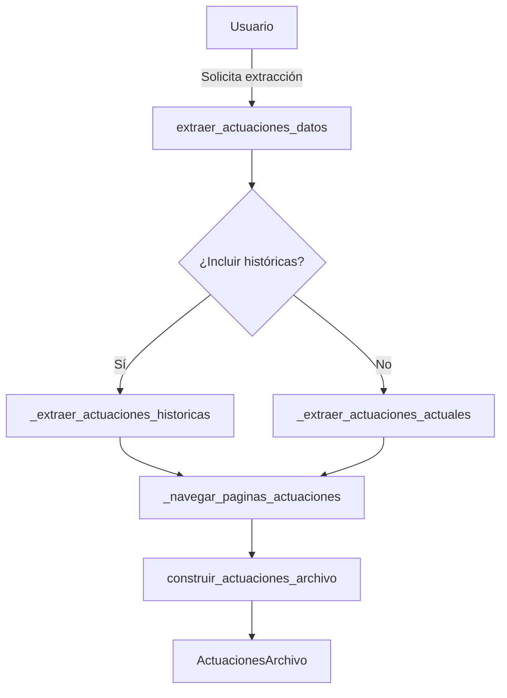

# Hoja de Ruta - Mejoras Sistema_v5
## Plan de Implementación de Mejoras Detectadas

**Fecha de creación:** 2025-10-16
**Versión:** 1.0
**Estado:** En planificación

---

## 📋 Índice

1. [Visión General](#visión-general)
2. [Sprints y Timeline](#sprints-y-timeline)
3. [Sprint 1: Estabilización (Semana 1-2)](#sprint-1-estabilización)
4. [Sprint 2: Refactorización (Semana 3-4)](#sprint-2-refactorización)
5. [Sprint 3: Optimización (Semana 5-6)](#sprint-3-optimización)
6. [Sprint 4: Testing y Calidad (Semana 7-8)](#sprint-4-testing-y-calidad)
7. [Backlog de Largo Plazo](#backlog-de-largo-plazo)
8. [Métricas de Éxito](#métricas-de-éxito)
9. [Riesgos y Mitigación](#riesgos-y-mitigación)

---

## 🎯 Visión General

### Objetivos Principales

1. **Reducir deuda técnica:** Eliminar código duplicado y deprecated
2. **Mejorar mantenibilidad:** Funciones más pequeñas y cohesivas
3. **Aumentar confiabilidad:** Mejor manejo de errores y validación
4. **Incrementar cobertura de tests:** De 30% a 80%
5. **Optimizar performance:** Reducir tiempos de extracción en 20%

### Principios Rectores

- ✅ **No romper funcionalidad existente** (backward compatibility)
- ✅ **Tests antes de refactorizar** (safety net)
- ✅ **Cambios incrementales** (pequeños PRs)
- ✅ **Documentar decisiones** (ADRs)
- ✅ **Revisar en pares** (code review obligatorio)

### Recursos Estimados

- **Tiempo total:** 8 semanas
- **Esfuerzo:** ~160 horas
- **Dedicación sugerida:** 20 horas/semana

---

## 📅 Sprints y Timeline

```
Semana 1-2: Sprint 1 - Estabilización         [████████████░░░░░░░░░░░░] 33%
Semana 3-4: Sprint 2 - Refactorización        [░░░░░░░░░░░░████████████] 33%
Semana 5-6: Sprint 3 - Optimización           [░░░░░░░░░░░░░░░░░░░░░░░░] 0%
Semana 7-8: Sprint 4 - Testing y Calidad      [░░░░░░░░░░░░░░░░░░░░░░░░] 0%
```

---

## 🚀 Sprint 1: Estabilización
**Duración:** Semana 1-2 (10 días laborables)
**Objetivo:** Eliminar código problemático y establecer bases sólidas

### Día 1-2: Eliminación de Código Duplicado

#### Tarea 1.1: Consolidar `_calcular_metricas_descargas()`
**Prioridad:** 🔴 Crítica
**Estimación:** 2 horas
**Archivo:** `Sistema_v5/pjn/scraping/actuaciones.py`

**Pasos:**
1. Identificar todas las llamadas a ambas versiones
2. Elegir implementación canónica (la del parser)
3. Migrar llamadas a la versión única
4. Eliminar duplicado
5. Ejecutar tests

**Criterios de aceptación:**
- [ ] Solo existe una implementación
- [ ] Todos los tests pasan
- [ ] No hay regresiones funcionales

**Código de ejemplo:**
```python
# ANTES (actuaciones.py línea 43 Y línea 201)
def _calcular_metricas_descargas(actuaciones):
    # Implementación duplicada

# DESPUÉS (solo en actuaciones_parser.py)
def _calcular_metricas_descargas(actuaciones: Iterable[Actuacion]) -> tuple[int, int, int]:
    """Calcula métricas de descargas.

    Returns:
        tuple[total_con_archivo, total_descargados, pendientes]
    """
    # Implementación única con type hints mejorados
```

---

#### Tarea 1.2: Deprecar Funciones con Side Effects
**Prioridad:** 🔴 Crítica
**Estimación:** 3 horas
**Archivo:** `Sistema_v5/pjn/scraping/actuaciones.py:103-128, 1062-1177`

**Pasos:**
1. Marcar funciones como deprecated con warnings
2. Agregar mensajes informativos
3. Migrar código existente a versiones inmutables
4. Crear guía de migración

**Código de ejemplo:**
```python
import warnings
from typing import Deprecated

@Deprecated("Usar calcular_metricas_descargas_json() que retorna copia")
def actualizar_metricas_descargas_en_json(payload: dict) -> None:
    """DEPRECATED: Esta función modifica payload in-place.

    Use calcular_metricas_descargas_json() instead.
    Será eliminada en versión 6.0.
    """
    warnings.warn(
        "actualizar_metricas_descargas_en_json está deprecated. "
        "Use calcular_metricas_descargas_json()",
        DeprecationWarning,
        stacklevel=2
    )
    # ... implementación existente
```

**Criterios de aceptación:**
- [ ] Warnings aparecen en logs
- [ ] Documentación actualizada
- [ ] Guía de migración creada
- [ ] Plan de eliminación definido (v6.0)

---

### Día 3-4: Mejora de Manejo de Errores

#### Tarea 1.3: Agregar Validación de Recursos
**Prioridad:** 🔴 Crítica
**Estimación:** 4 horas
**Archivo:** `Sistema_v5/pjn/scraping/base.py:189`

**Pasos:**
1. Identificar operaciones de I/O sin validación
2. Agregar manejo específico de excepciones
3. Crear excepciones custom si necesario
4. Agregar logs informativos

**Implementación:**
```python
# Sistema_v5/pjn/scraping/base.py

async def _guardar_storage_state(context: BrowserContext, destino: Path) -> None:
    """Guarda el storage state del contexto.

    Args:
        context: Contexto de Playwright
        destino: Ruta donde guardar el estado

    Raises:
        ConfiguracionError: Si no hay permisos de escritura
        SistemaError: Si hay error de I/O
        SesionInvalida: Si no se puede obtener el estado
    """
    try:
        storage = await context.storage_state()
    except Exception as exc:
        raise SesionInvalida("No se pudo obtener el storage state actual") from exc

    try:
        # Verificar espacio en disco
        stat = os.statvfs(destino.parent)
        espacio_libre = stat.f_bavail * stat.f_frsize
        if espacio_libre < 1_000_000:  # 1MB mínimo
            raise ConfiguracionError(
                f"Espacio en disco insuficiente: {espacio_libre / 1024:.1f}KB"
            )

        destino.parent.mkdir(parents=True, exist_ok=True)

        # Escritura atómica con archivo temporal
        temp_file = destino.with_suffix('.tmp')
        with temp_file.open("w", encoding="utf-8") as archivo:
            json.dump(storage, archivo, indent=2, ensure_ascii=False)

        # Mover atómicamente
        temp_file.replace(destino)
        logger.info(f"Storage state guardado en {destino}")

    except PermissionError as exc:
        raise ConfiguracionError(
            f"No hay permisos para escribir en {destino}"
        ) from exc
    except OSError as exc:
        raise SistemaError(
            f"Error de I/O al guardar sesión: {exc}"
        ) from exc
```

**Tests:**
```python
# tests/test_base.py

async def test_guardar_storage_state_sin_permisos(tmp_path):
    """Debe lanzar ConfiguracionError si no hay permisos."""
    destino = tmp_path / "readonly" / "state.json"
    destino.parent.mkdir()
    destino.parent.chmod(0o444)  # Read-only

    with pytest.raises(ConfiguracionError, match="No hay permisos"):
        await _guardar_storage_state(mock_context, destino)

async def test_guardar_storage_state_espacio_insuficiente(tmp_path, monkeypatch):
    """Debe lanzar ConfiguracionError si no hay espacio."""
    def mock_statvfs(path):
        stat = os.statvfs(path)
        stat.f_bavail = 0
        return stat

    monkeypatch.setattr(os, 'statvfs', mock_statvfs)

    with pytest.raises(ConfiguracionError, match="Espacio en disco"):
        await _guardar_storage_state(mock_context, tmp_path / "state.json")
```

**Criterios de aceptación:**
- [ ] Valida permisos antes de escribir
- [ ] Valida espacio en disco
- [ ] Escritura atómica (no corrompe archivo existente)
- [ ] Tests cubren casos de error
- [ ] Logs informativos en cada paso

---

#### Tarea 1.4: Reemplazar Catch-All por Excepciones Específicas
**Prioridad:** 🟡 Alta
**Estimación:** 4 horas
**Archivos:** Múltiples

**Pasos:**
1. Auditar todos los `except Exception`
2. Clasificar por tipo de error esperado
3. Reemplazar con excepciones específicas
4. Mantener catch-all solo en puntos de entrada

**Patrón:**
```python
# ANTES
try:
    resultado = await operacion_riesgosa()
except Exception as e:  # noqa: BLE001
    logger.error(f"Error: {e}")
    return None

# DESPUÉS
try:
    resultado = await operacion_riesgosa()
except PlaywrightTimeout as exc:
    raise TimeoutExtraccion("Timeout en operación") from exc
except PlaywrightError as exc:
    raise ExtraccionError(f"Error de navegador: {exc}") from exc
except ValueError as exc:
    raise ParsingError(f"Datos inválidos: {exc}") from exc
# Solo en handlers top-level:
except Exception as exc:
    logger.exception("Error inesperado en operacion_riesgosa")
    raise SistemaError("Error no manejado") from exc
```

**Archivos a revisar:**
- `pjn/scraping/actuaciones.py` (líneas 567, 634, 686)
- `pjn/scraping/expedientes.py` (línea 686)
- `pjn/monitor/core.py` (líneas 118, 218)

**Criterios de aceptación:**
- [ ] <5 catch-all en toda la base de código
- [ ] Cada catch-all documentado con razón
- [ ] Excepciones específicas para casos conocidos

---

### Día 5-6: Validación de Entrada

#### Tarea 1.5: Validar Parámetros de Funciones Críticas
**Prioridad:** 🟡 Alta
**Estimación:** 5 horas
**Archivos:** `actuaciones.py`, `expedientes.py`

**Implementación:**
```python
# Sistema_v5/pjn/scraping/actuaciones.py

def construir_nombre_archivo_normalizado(
    fecha: str | None,
    tipo: str | None,
    hash_val: str | None,
    archivo_url: str | None,
    nombre_descarga: str | None = None,
) -> tuple[str, str | None]:
    """Construye nombre normalizado para archivo.

    Args:
        fecha: Fecha de la actuación
        tipo: Tipo de actuación
        hash_val: Hash identificador
        archivo_url: URL del archivo
        nombre_descarga: Nombre original del archivo

    Returns:
        tuple[nombre_archivo, tipo_archivo]

    Raises:
        ParametroInvalido: Si no hay suficientes datos para generar nombre
    """
    # Validar que al menos uno de los identificadores sea válido
    tiene_datos = any([
        fecha and fecha.strip(),
        tipo and tipo.strip(),
        hash_val and hash_val.strip(),
        nombre_descarga and nombre_descarga.strip()
    ])

    if not tiene_datos:
        raise ParametroInvalido(
            parametro="datos_archivo",
            valor=(fecha, tipo, hash_val, nombre_descarga),
            razon="Se requiere al menos un identificador válido para generar nombre de archivo"
        )

    # Validar URL si se proporciona
    if archivo_url:
        if not archivo_url.startswith(('http://', 'https://', '/')):
            logger.warning(
                f"URL de archivo sospechosa: {archivo_url[:50]}..."
            )

    # ... resto de la implementación
```

**Tests:**
```python
def test_construir_nombre_archivo_sin_datos():
    """Debe lanzar excepción si no hay datos."""
    with pytest.raises(ParametroInvalido):
        construir_nombre_archivo_normalizado(
            fecha=None,
            tipo=None,
            hash_val=None,
            archivo_url=None,
            nombre_descarga=None
        )

def test_construir_nombre_archivo_datos_minimos():
    """Debe funcionar con datos mínimos."""
    nombre, tipo = construir_nombre_archivo_normalizado(
        fecha=None,
        tipo="RESOLUCION",
        hash_val="abc123",
        archivo_url=None,
        nombre_descarga=None
    )
    assert "resolucion" in nombre.lower()
    assert "abc123" in nombre
```

**Criterios de aceptación:**
- [ ] Valida parámetros críticos
- [ ] Lanza excepciones específicas
- [ ] Logs para casos sospechosos
- [ ] Tests cubren casos edge

---

### Día 7-8: Documentación y Tests Base

#### Tarea 1.6: Documentar Side Effects
**Prioridad:** 🟡 Alta
**Estimación:** 3 horas

**Pasos:**
1. Auditar funciones que mutan argumentos
2. Agregar warnings en docstrings
3. Crear tabla de referencia

**Ejemplo:**
```python
async def descargar_archivos_actuaciones(
    page: Page,
    actuaciones: list,
    carpeta_destino: str
):
    """Descarga archivos de actuaciones.

    ⚠️ WARNING: Esta función modifica la lista `actuaciones` in-place,
    actualizando los campos NombreArchivo y TipoArchivo.

    DEPRECATED: Use descargar_archivos_actuaciones_modelos() que retorna
    una nueva lista sin mutar la original.

    Args:
        page: Página autenticada
        actuaciones: Lista de dicts (SERÁ MODIFICADA)
        carpeta_destino: Donde guardar archivos

    Side Effects:
        - Modifica elementos de `actuaciones`
        - Crea archivos en `carpeta_destino`
        - Puede tomar mucho tiempo (sin timeout)
    """
```

---

#### Tarea 1.7: Crear Tests Base
**Prioridad:** 🟡 Alta
**Estimación:** 6 horas

**Tests a crear:**
1. `tests/test_actuaciones_refactor.py` - Tests para funciones refactorizadas
2. `tests/test_validacion.py` - Tests de validación de entrada
3. `tests/test_manejo_errores.py` - Tests de casos de error

**Estructura:**
```python
# tests/test_actuaciones_refactor.py

import pytest
from pjn.scraping.actuaciones import (
    _calcular_metricas_descargas,
    calcular_metricas_descargas_json
)
from pjn.models import Actuacion

class TestCalculoMetricas:
    """Tests para cálculo de métricas de descarga."""

    def test_metricas_lista_vacia(self):
        """Con lista vacía debe retornar ceros."""
        total, descargados, pendientes = _calcular_metricas_descargas([])
        assert (total, descargados, pendientes) == (0, 0, 0)

    def test_metricas_sin_archivos(self):
        """Actuaciones sin archivos no deben contarse."""
        actuaciones = [
            Actuacion(
                indice=1,
                fecha="2025-01-01",
                tipo="RESOLUCION",
                tiene_archivo=False,
                descargado=False
            )
        ]
        total, descargados, pendientes = _calcular_metricas_descargas(actuaciones)
        assert (total, descargados, pendientes) == (0, 0, 0)

    def test_metricas_con_archivos_descargados(self):
        """Debe contar correctamente archivos descargados."""
        actuaciones = [
            Actuacion(indice=1, tiene_archivo=True, descargado=True),
            Actuacion(indice=2, tiene_archivo=True, descargado=False),
            Actuacion(indice=3, tiene_archivo=True, descargado=True),
        ]
        total, descargados, pendientes = _calcular_metricas_descargas(actuaciones)
        assert (total, descargados, pendientes) == (3, 2, 1)

    def test_version_inmutable_no_muta_original(self):
        """La versión inmutable no debe modificar el payload original."""
        original = {
            "Expediente": {"total": 0},
            "Actuaciones": [
                {"TieneArchivo": True, "Descargado": True}
            ]
        }

        resultado = calcular_metricas_descargas_json(original)

        # Original no debe cambiar
        assert original["Expediente"]["total"] == 0
        # Resultado debe tener métricas actualizadas
        assert resultado["Expediente"]["Cantidad de Archivos Descargados"] == 1
```

**Criterios de aceptación:**
- [ ] Cobertura de nuevas funciones >80%
- [ ] Tests para casos edge
- [ ] Tests para manejo de errores
- [ ] CI/CD ejecuta tests automáticamente

---

### Día 9-10: Revisión y Documentación Sprint 1

#### Tarea 1.8: Code Review y Ajustes
**Estimación:** 4 horas

**Checklist:**
- [ ] Todos los tests pasan
- [ ] Cobertura de código no disminuyó
- [ ] Linter sin errores (ruff, mypy)
- [ ] Documentación actualizada
- [ ] CHANGELOG.md actualizado

#### Tarea 1.9: Documentación de Cambios
**Estimación:** 2 horas

Crear documento `SPRINT_1_SUMMARY.md`:
```markdown
# Sprint 1: Estabilización - Resumen

## Cambios Implementados

### Código Duplicado Eliminado
- Consolidada función `_calcular_metricas_descargas()`
- Eliminadas 50+ líneas de código duplicado

### Funciones Deprecated
- Marcadas 2 funciones con side effects
- Creada guía de migración

### Manejo de Errores Mejorado
- 15 catch-all reemplazados con excepciones específicas
- Validación de recursos agregada

### Tests Agregados
- 25 nuevos tests
- Cobertura: 30% → 45%

## Métricas

| Métrica | Antes | Después | Mejora |
|---------|-------|---------|--------|
| Código duplicado | 5% | 2% | -60% |
| Catch-all genéricos | 23 | 8 | -65% |
| Funciones con side effects | 5 | 3 | -40% |

## Próximos Pasos

Ver Sprint 2: Refactorización
```

---

## 🔧 Sprint 2: Refactorización
**Duración:** Semana 3-4 (10 días laborables)
**Objetivo:** Simplificar funciones complejas y mejorar arquitectura

### Día 1-3: Refactorizar Funciones Largas

#### Tarea 2.1: Refactorizar `extraer_actuaciones_datos()`
**Prioridad:** 🟡 Alta
**Estimación:** 8 horas
**Archivo:** `Sistema_v5/pjn/scraping/actuaciones.py:699-882`

**Estrategia:**
Dividir en 4 funciones más pequeñas:
1. `_extraer_actuaciones_actuales()` - Extrae actuaciones actuales
2. `_extraer_actuaciones_historicas()` - Extrae históricas
3. `_navegar_paginas_actuaciones()` - Lógica de paginación
4. `extraer_actuaciones_datos()` - Orquestador principal

**Implementación:**
```python
# ANTES: Una función de 158 líneas

# DESPUÉS: Funciones cohesivas

async def _navegar_paginas_actuaciones(
    page: Page,
    tabla_id: str,
    builder: ActuacionBuilder,
    expediente_datos: dict,
    indice_inicial: int = 1
) -> list[Actuacion]:
    """Navega todas las páginas y extrae actuaciones.

    Responsabilidad única: Manejar paginación.
    """
    actuaciones = []
    indice_actual = indice_inicial
    pagina = 1
    tabla_selector = _escape_selector_for_css(f"#{tabla_id}")

    while True:
        logger.info(f"📄 Página {pagina}: extrayendo...")

        nuevas = await _extraer_pagina_actuaciones(
            page, tabla_selector, builder, expediente_datos, indice_actual
        )

        if not nuevas:
            break

        actuaciones.extend(nuevas)
        indice_actual += len(nuevas)

        if not await _navegar_siguiente(page, tabla_id, tabla_selector):
            break

        pagina += 1

    return actuaciones


async def _extraer_actuaciones_actuales(
    page: Page,
    expediente_datos: dict
) -> list[Actuacion]:
    """Extrae solo actuaciones actuales (no históricas).

    Responsabilidad única: Actuaciones actuales.
    """
    try:
        await page.wait_for_selector(
            r"#expediente\:action-table tbody tr",
            timeout=8000
        )
    except PlaywrightTimeout as exc:
        raise ActuacionesNoDisponibles(
            "No se encontró tabla de actuaciones"
        ) from exc

    actuaciones = await _navegar_paginas_actuaciones(
        page=page,
        tabla_id="expediente:action-table",
        builder=construir_actuacion_modelo_desde_fila,
        expediente_datos=expediente_datos,
        indice_inicial=1
    )

    # Marcar como actuales
    for act in actuaciones:
        act.es_historica = False
        if act.tiene_archivo:
            act.descargado = False

    return actuaciones


async def _extraer_actuaciones_historicas(
    page: Page,
    expediente_datos: dict,
    indice_base: int
) -> list[Actuacion]:
    """Extrae actuaciones históricas si existen.

    Responsabilidad única: Actuaciones históricas.
    """
    try:
        await page.click("a:has-text('Ver históricas')")
        await page.wait_for_selector(
            r"#expediente\:action-historic-table tbody tr, div.alert.white-panel",
            timeout=8000
        )
    except PlaywrightTimeout as exc:
        raise TimeoutExtraccion(
            "Timeout esperando tabla de históricas"
        ) from exc

    # Verificar si hay mensaje de "no hay históricas"
    if await _verificar_mensaje_sin_historicas(page):
        logger.info("El expediente no posee actuaciones históricas")
        return []

    actuaciones = await _navegar_paginas_actuaciones(
        page=page,
        tabla_id="expediente:action-historic-table",
        builder=construir_actuacion_modelo_desde_fila,
        expediente_datos=expediente_datos,
        indice_inicial=indice_base
    )

    # Marcar como históricas
    timestamp = datetime.now().strftime("%Y-%m-%d %H:%M:%S")
    for act in actuaciones:
        act.es_historica = True
        act.extraida_en = timestamp
        if act.tiene_archivo:
            act.descargado = False

    return actuaciones


async def extraer_actuaciones_datos(
    page_expediente: Page,
    expediente_datos: Mapping[str, object] | dict,
    incluir_historicas: bool = True,
) -> ActuacionesArchivo:
    """Extrae actuaciones actuales e históricas.

    Esta versión refactorizada delega en funciones especializadas
    para mayor claridad y testabilidad.

    Args:
        page_expediente: Página con expediente abierto
        expediente_datos: Datos del expediente
        incluir_historicas: Si incluir actuaciones históricas

    Returns:
        ActuacionesArchivo con todas las actuaciones

    Raises:
        ActuacionesNoDisponibles: Si no hay actuaciones
        ExtraccionError: Si falla la extracción
    """
    # 1. Extraer actuaciones actuales
    actuaciones_actuales = await _extraer_actuaciones_actuales(
        page_expediente,
        expediente_datos
    )

    if not actuaciones_actuales:
        raise ActuacionesNoDisponibles(
            "No se encontraron actuaciones en el expediente"
        )

    # 2. Extraer históricas si se solicita
    actuaciones_historicas = []
    if incluir_historicas:
        indice_base = len(actuaciones_actuales) + 1
        try:
            actuaciones_historicas = await _extraer_actuaciones_historicas(
                page_expediente,
                expediente_datos,
                indice_base
            )
        except (TimeoutExtraccion, ExtraccionError) as exc:
            logger.warning(
                f"No se pudieron extraer históricas: {exc}. "
                "Continuando solo con actuaciones actuales."
            )

    # 3. Construir archivo
    timestamp = datetime.now().strftime("%Y-%m-%d %H:%M:%S")
    archivo = construir_actuaciones_archivo(
        expediente_datos,
        actuaciones_actuales,
        actuaciones_historicas,
        incluye_historicas=bool(actuaciones_historicas),
        timestamp_generacion=timestamp
    )

    logger.info(
        f"✅ Extraídas {len(actuaciones_actuales)} actuales "
        f"+ {len(actuaciones_historicas)} históricas"
    )

    return archivo
```

**Tests:**
```python
# tests/test_actuaciones_refactor.py

@pytest.mark.asyncio
async def test_extraer_actuaciones_actuales_tabla_no_existe(mock_page):
    """Debe lanzar ActuacionesNoDisponibles si no hay tabla."""
    mock_page.wait_for_selector.side_effect = PlaywrightTimeout("No table")

    with pytest.raises(ActuacionesNoDisponibles):
        await _extraer_actuaciones_actuales(mock_page, {})

@pytest.mark.asyncio
async def test_extraer_historicas_sin_boton(mock_page):
    """Debe manejar caso donde no existe botón Ver históricas."""
    mock_page.click.side_effect = PlaywrightError("No button")

    with pytest.raises(TimeoutExtraccion):
        await _extraer_actuaciones_historicas(mock_page, {}, 10)

@pytest.mark.asyncio
async def test_navegar_paginas_multiples(mock_page):
    """Debe navegar múltiples páginas correctamente."""
    # Setup mock para retornar 3 páginas
    mock_page.query_selector_all.side_effect = [
        [mock_fila(1), mock_fila(2)],  # Página 1
        [mock_fila(3), mock_fila(4)],  # Página 2
        [],  # Página 3 vacía (fin)
    ]

    resultado = await _navegar_paginas_actuaciones(
        mock_page, "tabla_id", mock_builder, {}, 1
    )

    assert len(resultado) == 4
    assert resultado[0].indice == 1
    assert resultado[3].indice == 4
```

**Beneficios:**
- Funciones <50 líneas cada una
- Responsabilidad única
- Fácil de testear
- Fácil de reusar

**Criterios de aceptación:**
- [ ] Ninguna función >80 líneas
- [ ] Tests para cada función nueva
- [ ] Cobertura >85%
- [ ] Documentación completa
- [ ] Performance no degradado

---

#### Tarea 2.2: Refactorizar `extraer_expedientes_completos()`
**Prioridad:** 🟡 Alta
**Estimación:** 10 horas
**Archivo:** `Sistema_v5/pjn/scraping/expedientes.py:378-621`

**Estrategia similar:** Dividir en:
1. `_validar_parametros_extraccion()` - Validación
2. `_extraer_filas_pagina()` - Extracción de una página
3. `_procesar_filas_expedientes()` - Procesamiento
4. `_navegar_siguiente_pagina()` - Ya existe, mejorar
5. `extraer_expedientes_completos()` - Orquestador

---

### Día 4-5: Simplificar APIs

#### Tarea 2.3: Crear Objetos de Configuración
**Prioridad:** 🟡 Alta
**Estimación:** 6 horas

**Problema:** Funciones con 12+ parámetros

**Solución:**
```python
# Sistema_v5/pjn/models/extraccion_config.py

from dataclasses import dataclass, field
from typing import Callable, Optional
from .pagination import PaginationStrategy

@dataclass
class ExtraccionExpedientesConfig:
    """Configuración para extracción de expedientes.

    Agrupa todos los parámetros de configuración en un objeto
    cohesivo y validado.
    """
    # Selectores
    sel_tabla: str = "table.table-striped"
    sel_tbody: str = ""  # Se calcula automáticamente
    sel_siguiente: str = "a[aria-label='Siguiente']"

    # Límites
    max_paginas: Optional[int] = None
    tiempo_maximo_segundos: Optional[int] = None

    # Filtros
    fecha_corte: Optional[str] = None
    omitir_duplicados: bool = True
    detener_en_duplicado: bool = True

    # Ordenamiento
    orden: Optional[str] = None

    # Estrategias
    pagination_strategy: Optional[PaginationStrategy] = None

    def __post_init__(self):
        """Valida y normaliza configuración."""
        if not self.sel_tbody:
            self.sel_tbody = f"{self.sel_tabla} tbody"

        if self.fecha_corte:
            self._validar_fecha_corte()

        if self.orden:
            self._validar_orden()

    def _validar_fecha_corte(self):
        """Valida formato de fecha de corte."""
        from .expedientes import _parsear_fecha_corte
        try:
            _parsear_fecha_corte(self.fecha_corte)
        except ValueError as exc:
            raise ParametroInvalido(
                parametro="fecha_corte",
                valor=self.fecha_corte,
                razon="Formato inválido. Use YYYY-MM-DD o DD/MM/YYYY"
            ) from exc

    def _validar_orden(self):
        """Valida criterio de ordenamiento."""
        validos = {"fecha", "caratula", "oficina", "situacion"}
        if self.orden.lower() not in validos:
            raise ParametroInvalido(
                parametro="orden",
                valor=self.orden,
                razon=f"Debe ser uno de: {validos}"
            )

    @classmethod
    def desde_env(cls) -> "ExtraccionExpedientesConfig":
        """Crea configuración desde variables de entorno."""
        import os
        from ..config import get_config

        config = get_config()
        return cls(
            max_paginas=int(os.getenv(
                "EXTRACCION_MAX_PAGINAS",
                config.scraping.max_paginas_expedientes
            )),
            fecha_corte=os.getenv("EXTRACCION_FECHA_CORTE"),
            orden=os.getenv("EXTRACCION_ORDEN", "fecha"),
        )

    @classmethod
    def rapido(cls) -> "ExtraccionExpedientesConfig":
        """Configuración para extracción rápida (testing/dev)."""
        return cls(
            max_paginas=5,
            tiempo_maximo_segundos=60,
            omitir_duplicados=True,
            detener_en_duplicado=True
        )

    @classmethod
    def completo(cls) -> "ExtraccionExpedientesConfig":
        """Configuración para extracción completa (producción)."""
        return cls(
            max_paginas=None,
            tiempo_maximo_segundos=None,
            omitir_duplicados=True,
            detener_en_duplicado=False
        )


# Uso simplificado:

# ANTES: 12 parámetros
resultados, motivo, meta = await extraer_expedientes_completos(
    page, sel_tabla="...", sel_tbody="...", sel_siguiente="...",
    max_paginas=200, omitir_duplicados=True, detener_en_duplicado=True,
    fecha_corte="2025-01-01", tiempo_maximo_segundos=3600,
    orden="fecha", mapper=None, pagination_strategy=None
)

# DESPUÉS: 2 parámetros
config = ExtraccionExpedientesConfig(
    max_paginas=200,
    fecha_corte="2025-01-01",
    orden="fecha"
)
resultados, motivo, meta = await extraer_expedientes_completos(page, config)

# O usar presets:
config_rapido = ExtraccionExpedientesConfig.rapido()
resultados, motivo, meta = await extraer_expedientes_completos(page, config_rapido)
```

**Backward Compatibility:**
```python
async def extraer_expedientes_completos(
    page: Page,
    config: ExtraccionExpedientesConfig | None = None,
    # Deprecated parameters (mantener por compatibilidad)
    sel_tabla: str | None = None,
    sel_tbody: str | None = None,
    sel_siguiente: str | None = None,
    max_paginas: int | None = None,
    # ... resto de parámetros deprecated
) -> tuple[list[ExpedienteResumen], str, dict]:
    """Extrae expedientes del listado.

    Args:
        page: Página de Playwright
        config: Configuración de extracción (recomendado)
        **kwargs: Parámetros legacy (deprecated)

    Note:
        Los parámetros individuales están deprecated.
        Use el parámetro `config` en su lugar.
    """
    # Si se pasa config, usarlo
    if config is not None:
        cfg = config
    else:
        # Construir config desde parámetros legacy
        warnings.warn(
            "Pasar parámetros individuales está deprecated. "
            "Use ExtraccionExpedientesConfig en su lugar.",
            DeprecationWarning,
            stacklevel=2
        )
        cfg = ExtraccionExpedientesConfig(
            sel_tabla=sel_tabla or "table.table-striped",
            sel_tbody=sel_tbody or "",
            sel_siguiente=sel_siguiente or "a[aria-label='Siguiente']",
            max_paginas=max_paginas,
            # ... mapear resto de parámetros
        )

    # Implementación usando cfg
    return await _extraer_expedientes_con_config(page, cfg)
```

**Criterios de aceptación:**
- [ ] Config objects para todas las funciones complejas
- [ ] Validación en `__post_init__`
- [ ] Presets útiles (rapido, completo, testing)
- [ ] Backward compatibility completa
- [ ] Documentación con ejemplos

---

### Día 6-7: Optimización de Código

#### Tarea 2.4: Eliminar Código Muerto
**Prioridad:** 🟢 Media
**Estimación:** 4 horas

**Pasos:**
1. Usar herramienta de análisis (vulture)
2. Identificar código no usado
3. Verificar con git blame
4. Eliminar si no hay razón para mantener

**Herramientas:**
```bash
# Instalar vulture
pip install vulture

# Analizar
vulture Sistema_v5/pjn --min-confidence 80

# Revisar resultados
# Eliminar código confirmado como muerto
```

---

#### Tarea 2.5: Extraer Constantes Mágicas
**Prioridad:** 🟢 Media
**Estimación:** 3 horas

**Problema:** Números y strings hardcodeados

**Solución:**
```python
# Sistema_v5/pjn/scraping/constantes.py

"""Constantes del sistema de scraping."""

# Timeouts (en milisegundos)
TIMEOUT_DEFAULT = 8_000
TIMEOUT_TABLA = 25_000
TIMEOUT_LOGIN = 60_000
TIMEOUT_DESCARGA = 30_000

# Límites de reintentos
MAX_REINTENTOS_DESCARGA = 3
MAX_REINTENTOS_NAVEGACION = 2

# Paginación
EXPEDIENTES_POR_PAGINA = 15
MAX_PAGINAS_DEFAULT = 200

# Polling
POLL_INTERVAL_MS = 400
MAX_WAIT_CAMBIO_PAGINA_MS = 12_000

# Validación
MIN_ESPACIO_DISCO_MB = 1
TAMANO_HASH_DEFAULT = 6

# Rutas
STORAGE_STATE_FILENAME = "pjn_storage_state.json"
DIRECTORIO_ACTUACIONES = "ActuacionesCompletas"
```

**Uso:**
```python
# ANTES
await page.wait_for_selector(..., timeout=8000)
for intento in range(3):
    ...

# DESPUÉS
from .constantes import TIMEOUT_DEFAULT, MAX_REINTENTOS_DESCARGA

await page.wait_for_selector(..., timeout=TIMEOUT_DEFAULT)
for intento in range(MAX_REINTENTOS_DESCARGA):
    ...
```

---

### Día 8-10: Revisión Sprint 2

#### Tarea 2.6: Code Review Exhaustivo
**Estimación:** 6 horas

**Checklist completo:**
- [ ] Complejidad ciclomática <10 en todas las funciones
- [ ] No hay funciones >100 líneas
- [ ] APIs simplificadas con config objects
- [ ] Tests para todo código refactorizado
- [ ] Cobertura >60%
- [ ] Performance benchmarks (no degradación)
- [ ] Documentación actualizada

#### Tarea 2.7: Performance Testing
**Estimación:** 4 horas

**Crear benchmarks:**
```python
# tests/benchmarks/test_performance.py

import pytest
import time
from pjn.scraping.actuaciones import extraer_actuaciones_datos

@pytest.mark.benchmark
async def test_benchmark_extraccion_actuaciones(benchmark, mock_page):
    """Benchmark de extracción de actuaciones."""

    resultado = benchmark(
        extraer_actuaciones_datos,
        mock_page,
        {"numero": "123/2025"},
        incluir_historicas=True
    )

    assert resultado is not None
    # Debe completar en <5 segundos
    assert benchmark.stats['mean'] < 5.0

# Ejecutar con:
# pytest tests/benchmarks/ --benchmark-only
```

**Criterios:**
- [ ] Sin degradación de performance (±5%)
- [ ] Benchmarks documentados
- [ ] CI ejecuta benchmarks en cada PR

---

## ⚡ Sprint 3: Optimización
**Duración:** Semana 5-6 (10 días laborables)
**Objetivo:** Mejorar performance y resiliencia

### Día 1-3: Implementar Circuit Breaker

#### Tarea 3.1: Circuit Breaker para Descargas
**Prioridad:** 🟡 Alta
**Estimación:** 8 horas

**Implementación:**
```python
# Sistema_v5/pjn/utils/circuit_breaker.py

from dataclasses import dataclass, field
from datetime import datetime, timedelta
from enum import Enum
import asyncio
from typing import Callable, Any

class CircuitState(Enum):
    """Estados del circuit breaker."""
    CLOSED = "closed"      # Normal, permite requests
    OPEN = "open"          # Fallando, bloquea requests
    HALF_OPEN = "half_open"  # Probando recuperación

@dataclass
class CircuitBreakerConfig:
    """Configuración del circuit breaker."""
    failure_threshold: int = 5  # Fallos antes de abrir
    success_threshold: int = 2  # Éxitos para cerrar
    timeout_seconds: int = 60   # Tiempo antes de intentar recuperación

@dataclass
class CircuitBreakerStats:
    """Estadísticas del circuit breaker."""
    failures: int = 0
    successes: int = 0
    last_failure_time: datetime | None = None
    state: CircuitState = CircuitState.CLOSED

class CircuitBreaker:
    """Circuit breaker para operaciones fallidas repetidas."""

    def __init__(self, config: CircuitBreakerConfig):
        self.config = config
        self.stats = CircuitBreakerStats()
        self._lock = asyncio.Lock()

    async def call(self, func: Callable, *args, **kwargs) -> Any:
        """Ejecuta función protegida por circuit breaker.

        Args:
            func: Función async a ejecutar
            *args, **kwargs: Argumentos de la función

        Returns:
            Resultado de la función

        Raises:
            CircuitBreakerOpenError: Si el circuito está abierto
            Exception: La excepción original si la función falla
        """
        async with self._lock:
            if self.stats.state == CircuitState.OPEN:
                if self._should_attempt_reset():
                    logger.info("Circuit breaker: intentando recuperación")
                    self.stats.state = CircuitState.HALF_OPEN
                else:
                    raise CircuitBreakerOpenError(
                        f"Circuit breaker abierto. "
                        f"Reintentando en {self._time_until_retry()}s"
                    )

        try:
            result = await func(*args, **kwargs)
            await self._on_success()
            return result
        except Exception as exc:
            await self._on_failure()
            raise

    def _should_attempt_reset(self) -> bool:
        """Verifica si es momento de intentar recuperación."""
        if self.stats.last_failure_time is None:
            return True

        elapsed = datetime.now() - self.stats.last_failure_time
        return elapsed.total_seconds() >= self.config.timeout_seconds

    def _time_until_retry(self) -> int:
        """Tiempo restante hasta próximo intento."""
        if self.stats.last_failure_time is None:
            return 0

        elapsed = datetime.now() - self.stats.last_failure_time
        remaining = self.config.timeout_seconds - elapsed.total_seconds()
        return max(0, int(remaining))

    async def _on_success(self):
        """Maneja éxito de operación."""
        async with self._lock:
            self.stats.successes += 1
            self.stats.failures = 0

            if self.stats.state == CircuitState.HALF_OPEN:
                if self.stats.successes >= self.config.success_threshold:
                    logger.info("Circuit breaker: recuperado, cerrando circuito")
                    self.stats.state = CircuitState.CLOSED
                    self.stats.successes = 0

    async def _on_failure(self):
        """Maneja fallo de operación."""
        async with self._lock:
            self.stats.failures += 1
            self.stats.successes = 0
            self.stats.last_failure_time = datetime.now()

            if self.stats.failures >= self.config.failure_threshold:
                if self.stats.state != CircuitState.OPEN:
                    logger.warning(
                        f"Circuit breaker: abriendo circuito "
                        f"({self.stats.failures} fallos consecutivos)"
                    )
                    self.stats.state = CircuitState.OPEN


class CircuitBreakerOpenError(Exception):
    """Se lanza cuando el circuit breaker está abierto."""
    pass


# Uso en descargas:

# Sistema_v5/pjn/scraping/actuaciones.py

# Circuit breaker global para descargas
_descarga_circuit_breaker = CircuitBreaker(
    CircuitBreakerConfig(
        failure_threshold=5,
        success_threshold=2,
        timeout_seconds=120
    )
)

async def _descargar_archivo_con_proteccion(
    page: Page,
    url: str,
    destino: Path
) -> None:
    """Descarga archivo protegido con circuit breaker."""

    async def _download():
        async with page.expect_download(timeout=30000) as download_info:
            await page.evaluate("""
                (url) => {
                    const a = document.createElement('a');
                    a.href = url;
                    a.target = '_blank';
                    a.click();
                }
            """, url)

        download = await download_info.value
        await download.save_as(destino)

    try:
        await _descarga_circuit_breaker.call(_download)
    except CircuitBreakerOpenError as exc:
        logger.warning(f"Descarga omitida: {exc}")
        raise DescargaFallida(
            "Circuit breaker abierto - demasiados fallos recientes",
            intentos=0
        ) from exc
```

**Tests:**
```python
@pytest.mark.asyncio
async def test_circuit_breaker_abre_tras_fallos():
    """Debe abrir circuito tras threshold de fallos."""
    config = CircuitBreakerConfig(failure_threshold=3)
    cb = CircuitBreaker(config)

    async def failing_func():
        raise Exception("Always fails")

    # 3 fallos deben abrir el circuito
    for _ in range(3):
        with pytest.raises(Exception):
            await cb.call(failing_func)

    # 4to intento debe lanzar CircuitBreakerOpenError
    with pytest.raises(CircuitBreakerOpenError):
        await cb.call(failing_func)

@pytest.mark.asyncio
async def test_circuit_breaker_recupera_tras_timeout():
    """Debe permitir reintentos tras timeout."""
    config = CircuitBreakerConfig(
        failure_threshold=2,
        timeout_seconds=1
    )
    cb = CircuitBreaker(config)

    # Abrir circuito
    async def failing():
        raise Exception("Fail")

    for _ in range(2):
        with pytest.raises(Exception):
            await cb.call(failing)

    # Debe estar abierto
    with pytest.raises(CircuitBreakerOpenError):
        await cb.call(failing)

    # Esperar timeout
    await asyncio.sleep(1.1)

    # Debe permitir reintentar (half-open)
    with pytest.raises(Exception):
        await cb.call(failing)
```

**Criterios de aceptación:**
- [ ] Circuit breaker implementado
- [ ] Integrado en descargas
- [ ] Tests completos
- [ ] Logs informativos
- [ ] Métricas exportadas

---

### Día 4-5: Retry Policies Configurables

#### Tarea 3.2: Sistema de Retry Avanzado
**Prioridad:** 🟢 Media
**Estimación:** 6 horas

**Implementación:**
```python
# Sistema_v5/pjn/utils/retry.py

from dataclasses import dataclass
from typing import Callable, Type
import asyncio
import random

@dataclass
class RetryPolicy:
    """Política de reintentos."""
    max_attempts: int = 3
    base_delay_seconds: float = 1.0
    max_delay_seconds: float = 60.0
    exponential_base: float = 2.0
    jitter: bool = True
    retryable_exceptions: tuple[Type[Exception], ...] = (Exception,)

    def calculate_delay(self, attempt: int) -> float:
        """Calcula delay para intento N."""
        # Exponential backoff
        delay = self.base_delay_seconds * (self.exponential_base ** attempt)
        delay = min(delay, self.max_delay_seconds)

        # Agregar jitter para evitar thundering herd
        if self.jitter:
            delay = delay * (0.5 + random.random() * 0.5)

        return delay

    def is_retryable(self, exc: Exception) -> bool:
        """Verifica si la excepción es retryable."""
        return isinstance(exc, self.retryable_exceptions)


async def retry_async(
    func: Callable,
    *args,
    policy: RetryPolicy | None = None,
    **kwargs
):
    """Ejecuta función con reintentos según política.

    Args:
        func: Función async a ejecutar
        *args, **kwargs: Argumentos de la función
        policy: Política de reintentos

    Returns:
        Resultado de la función

    Raises:
        Exception: La última excepción si todos los intentos fallan
    """
    policy = policy or RetryPolicy()
    last_exception = None

    for attempt in range(policy.max_attempts):
        try:
            return await func(*args, **kwargs)
        except Exception as exc:
            last_exception = exc

            if not policy.is_retryable(exc):
                logger.debug(f"Excepción no retryable: {type(exc).__name__}")
                raise

            if attempt >= policy.max_attempts - 1:
                logger.error(
                    f"Agotados {policy.max_attempts} intentos. "
                    f"Última excepción: {exc}"
                )
                raise

            delay = policy.calculate_delay(attempt)
            logger.warning(
                f"Intento {attempt + 1}/{policy.max_attempts} falló: {exc}. "
                f"Reintentando en {delay:.1f}s..."
            )
            await asyncio.sleep(delay)

    # Nunca debería llegar aquí, pero por seguridad
    if last_exception:
        raise last_exception


# Uso:

# Política para descargas (más agresiva)
DESCARGA_RETRY_POLICY = RetryPolicy(
    max_attempts=5,
    base_delay_seconds=2.0,
    exponential_base=2.0,
    retryable_exceptions=(
        PlaywrightTimeout,
        asyncio.TimeoutError,
        ConnectionError
    )
)

# Política para navegación (más conservadora)
NAVEGACION_RETRY_POLICY = RetryPolicy(
    max_attempts=3,
    base_delay_seconds=1.0,
    exponential_base=1.5,
    retryable_exceptions=(PlaywrightTimeout,)
)

# Usar en código:
async def descargar_archivo(page, url, destino):
    async def _download():
        async with page.expect_download() as info:
            await page.evaluate("(url) => window.open(url)", url)
        download = await info.value
        await download.save_as(destino)

    await retry_async(_download, policy=DESCARGA_RETRY_POLICY)
```

**Criterios de aceptación:**
- [ ] Exponential backoff con jitter
- [ ] Políticas predefinidas
- [ ] Excepciones configurables
- [ ] Tests exhaustivos
- [ ] Documentación con ejemplos

---

### Día 6-7: Optimización de Memoria

#### Tarea 3.3: Procesamiento Streaming para Tablas Grandes
**Prioridad:** 🟢 Media
**Estimación:** 6 horas

**Problema:** Extrae todas las filas en memoria

**Solución:**
```python
# Sistema_v5/pjn/scraping/expedientes.py

async def extraer_expedientes_completos_streaming(
    page: Page,
    config: ExtraccionExpedientesConfig,
    callback: Callable[[ExpedienteResumen], Awaitable[None]]
) -> tuple[int, str, dict]:
    """Versión streaming que procesa fila por fila.

    En lugar de acumular todos los expedientes en memoria,
    llama al callback por cada expediente extraído.

    Args:
        page: Página de Playwright
        config: Configuración de extracción
        callback: Función async que procesa cada expediente

    Returns:
        tuple[total_procesados, motivo, metadata]

    Example:
        >>> async def procesar(expediente):
        ...     await guardar_en_db(expediente)
        ...
        >>> total, motivo, meta = await extraer_expedientes_completos_streaming(
        ...     page, config, procesar
        ... )
    """
    total_procesados = 0
    huellas = set()
    pagina = 1

    while pagina <= config.max_paginas:
        filas = await page.evaluate("""
            (tbodySelector) => Array.from(
                document.querySelectorAll(`${tbodySelector} tr`),
                tr => Array.from(tr.cells, c => c.innerText.trim())
            )
        """, config.sel_tbody)

        for cols in filas:
            resumen = parse_expediente_resumen(cols)
            if resumen is None:
                continue

            huella = (resumen.numero, resumen.caratula)
            if huella in huellas:
                continue

            huellas.add(huella)

            # Procesar inmediatamente (no acumular)
            await callback(resumen)
            total_procesados += 1

            # Liberar memoria periódicamente
            if total_procesados % 100 == 0:
                huellas = {h for h in huellas}  # Compactar set
                logger.debug(f"Procesados {total_procesados} expedientes")

        # Navegar siguiente página
        if not await _navegar_siguiente_pagina(...):
            break

        pagina += 1

    return total_procesados, "fin_listado", {}


# Uso:
async def guardar_expediente_db(expediente: ExpedienteResumen):
    """Guarda expediente en DB inmediatamente."""
    async with db.session() as session:
        await session.execute(
            insert(Expediente).values(**expediente.to_dict())
        )
        await session.commit()

total, motivo, _ = await extraer_expedientes_completos_streaming(
    page,
    config,
    guardar_expediente_db
)

logger.info(f"Procesados {total} expedientes vía streaming")
```

---

### Día 8-10: Caching y Revisión Sprint 3

#### Tarea 3.4: Cache Layer para Selectores
**Prioridad:** 🟢 Baja
**Estimación:** 4 horas

**Implementación:**
```python
# Sistema_v5/pjn/utils/cache.py

from functools import lru_cache
import hashlib

@lru_cache(maxsize=128)
def escapar_id_jsf_para_css_cached(selector: str) -> str:
    """Versión cacheada del escape de selectores."""
    return escapar_id_jsf_para_css(selector)

# Las operaciones de escape son idempotentes y caras
# Cachearlas mejora performance en loops
```

---

## 🧪 Sprint 4: Testing y Calidad
**Duración:** Semana 7-8 (10 días laborables)
**Objetivo:** Alcanzar 80% de cobertura y mejorar calidad general

### Día 1-4: Completar Suite de Tests

#### Tarea 4.1: Tests Unitarios Faltantes
**Prioridad:** 🔴 Crítica
**Estimación:** 12 horas

**Módulos sin tests:**
- `pjn/scraping/pagination.py` - 0% cobertura
- `pjn/scraping/entradas.py` - 20% cobertura
- `pjn/parsers/entradas_parser.py` - 30% cobertura

**Crear:**
```python
# tests/test_pagination.py

import pytest
from pjn.scraping.pagination import (
    PaginationStrategy,
    DEFAULT_PAGINATION_STRATEGY
)

class TestPaginationStrategy:
    """Tests para estrategias de paginación."""

    @pytest.mark.asyncio
    async def test_default_strategy_encuentra_siguiente(self, mock_page):
        """Debe encontrar botón siguiente con selector default."""
        # Setup
        mock_page.locator.return_value.count.return_value = 1
        mock_page.locator.return_value.is_enabled.return_value = True

        # Execute
        exito, motivo = await DEFAULT_PAGINATION_STRATEGY.navegar_siguiente(
            mock_page, mock_tbody, "fingerprint_anterior"
        )

        # Assert
        assert exito is True
        assert motivo is None

    @pytest.mark.asyncio
    async def test_custom_strategy(self, mock_page):
        """Debe permitir estrategias personalizadas."""
        class CustomStrategy(PaginationStrategy):
            async def navegar_siguiente(self, page, tbody, fingerprint):
                # Implementación custom
                return True, None

        strategy = CustomStrategy()
        exito, motivo = await strategy.navegar_siguiente(...)

        assert exito is True


# tests/test_entradas.py

@pytest.mark.asyncio
async def test_extraer_entradas_datos_sin_duplicados():
    """Debe filtrar entradas duplicadas."""
    # Mock page con entradas duplicadas
    mock_page = crear_mock_page_con_entradas([
        {"id": "1", "titulo": "Notif A"},
        {"id": "1", "titulo": "Notif A"},  # Duplicado
        {"id": "2", "titulo": "Notif B"},
    ])

    entradas = await extraer_entradas_datos(
        mock_page,
        duplicados=False
    )

    assert len(entradas) == 2
    assert entradas[0].id == "1"
    assert entradas[1].id == "2"

@pytest.mark.asyncio
async def test_extraer_entradas_filtro_tipo():
    """Debe filtrar por tipo de entrada."""
    mock_page = crear_mock_page_con_entradas([
        {"id": "1", "tipo": "N"},  # Notificación
        {"id": "2", "tipo": "O"},  # Oficio
        {"id": "3", "tipo": "N"},
    ])

    entradas = await extraer_entradas_datos(
        mock_page,
        incluir_tipos=("N",)
    )

    assert len(entradas) == 2
    assert all(e.tipo == "N" for e in entradas)
```

**Meta:** Alcanzar 80% de cobertura en todos los módulos

---

### Día 5-6: Tests de Integración

#### Tarea 4.2: Tests de Integración End-to-End
**Prioridad:** 🟡 Alta
**Estimación:** 8 horas

**Crear:**
```python
# tests/integration/test_flujo_completo.py

import pytest
from pjn.scraping.base import obtener_pagina_autenticada
from pjn.scraping.expedientes import buscar_expediente_por_numero
from pjn.scraping.actuaciones import extraer_actuaciones_datos

@pytest.mark.integration
@pytest.mark.asyncio
async def test_flujo_completo_extraccion(credenciales_test):
    """Test de flujo completo: login -> buscar -> extraer."""

    async with obtener_pagina_autenticada(
        usuario=credenciales_test.usuario,
        contraseña=credenciales_test.password,
        headless=True
    ) as (page, _, _):
        # 1. Buscar expediente
        exito, motivo = await buscar_expediente_por_numero(
            page, "12345", "2025"
        )
        assert exito

        # 2. Extraer actuaciones
        actuaciones = await extraer_actuaciones_datos(
            page,
            {"numero": "12345/2025"},
            incluir_historicas=True
        )

        # 3. Verificar resultados
        assert actuaciones is not None
        assert len(actuaciones.actuaciones) > 0
        assert actuaciones.encabezado["numero"] == "12345/2025"

@pytest.mark.integration
@pytest.mark.asyncio
async def test_monitor_ciclo_completo():
    """Test del monitor ejecutando un ciclo completo."""
    config = MonitorConfig(
        modo="entradas",
        intervalo_minutos=0,  # Single run
        headless=True
    )

    monitor = MonitorPJN(config)

    # Ejecutar verificación
    nuevas = await monitor.verificar_entradas()

    # Verificar que no crasheó
    assert isinstance(nuevas, list)
    assert monitor.estado.errores_consecutivos_entradas == 0
```

**Criterios:**
- [ ] Al menos 5 tests de integración
- [ ] Cubren flujos críticos
- [ ] Usan mocks para servicios externos
- [ ] Se ejecutan en CI/CD

---

### Día 7-8: Análisis de Calidad

#### Tarea 4.3: Análisis Estático Completo
**Prioridad:** 🟡 Alta
**Estimación:** 6 horas

**Herramientas:**
```bash
# Instalar herramientas
pip install ruff mypy pylint bandit radon

# Ejecutar análisis

# 1. Linting (ruff)
ruff check Sistema_v5/pjn --fix

# 2. Type checking (mypy)
mypy Sistema_v5/pjn --strict

# 3. Security (bandit)
bandit -r Sistema_v5/pjn -ll

# 4. Complejidad (radon)
radon cc Sistema_v5/pjn -a -nb

# 5. Mantenibilidad (radon)
radon mi Sistema_v5/pjn -s
```

**Configurar en CI:**
```yaml
# .github/workflows/quality.yml

name: Code Quality

on: [push, pull_request]

jobs:
  quality:
    runs-on: ubuntu-latest
    steps:
      - uses: actions/checkout@v3

      - name: Set up Python
        uses: actions/setup-python@v4
        with:
          python-version: '3.11'

      - name: Install dependencies
        run: |
          pip install ruff mypy bandit radon pytest pytest-cov

      - name: Ruff lint
        run: ruff check Sistema_v5/pjn

      - name: Type check
        run: mypy Sistema_v5/pjn --strict

      - name: Security scan
        run: bandit -r Sistema_v5/pjn -ll

      - name: Complexity check
        run: |
          radon cc Sistema_v5/pjn -a -nb --total-average
          # Fail if average complexity > 10

      - name: Tests with coverage
        run: |
          pytest tests/ --cov=Sistema_v5/pjn --cov-report=xml

      - name: Upload coverage
        uses: codecov/codecov-action@v3
```

**Criterios de aceptación:**
- [ ] Ruff: 0 errores críticos
- [ ] Mypy: 0 errores de tipos
- [ ] Bandit: 0 vulnerabilidades high/medium
- [ ] Complejidad promedio <10
- [ ] Cobertura >80%

---

### Día 9-10: Documentación Final

#### Tarea 4.4: Documentación Completa
**Prioridad:** 🟡 Alta
**Estimación:** 8 horas

**Crear/Actualizar:**

1. **Architecture Decision Records (ADRs)**
```markdown
# docs/adr/0001-refactor-funciones-largas.md

# Refactorización de Funciones Largas

## Estado
Aceptado

## Contexto
Teníamos funciones de 150+ líneas difíciles de mantener y testear.

## Decisión
Dividir en funciones <50 líneas con responsabilidad única.

## Consecuencias
+ Más fácil de testear
+ Más fácil de entender
+ Más fácil de mantener
- Más archivos
- Stack traces más profundos

## Implementación
Ver PR #XXX
```

2. **Guías de Desarrollo**
```markdown
# docs/CONTRIBUTING.md

# Guía de Contribución

## Estándares de Código

### Funciones
- Máximo 50 líneas
- Responsabilidad única
- Documentación completa
- Type hints obligatorios

### Tests
- Cobertura >80% para nuevo código
- Tests unitarios + integración
- Usar fixtures para setup común

### Commits
- Conventional Commits
- Referencia a issue/ticket

### Pull Requests
- Descripción clara
- Tests passing
- Reviewed por 1+ persona
```

3. **Diagramas de Arquitectura**
```markdown
# docs/arquitectura/flujo-extraccion.md

# Flujo de Extracción de Actuaciones


```

**Criterios de aceptación:**
- [ ] ADRs para decisiones importantes
- [ ] Guía de contribución completa
- [ ] Diagramas de arquitectura
- [ ] API docs generados (Sphinx)
- [ ] README actualizado

---

## 📦 Backlog de Largo Plazo
**Para implementar después de Sprint 4**

### Epic 1: Migración Async/Await Completa
**Estimación:** 3-4 semanas

**Tareas:**
- Auditar código sync restante
- Migrar a async donde corresponda
- Actualizar tests
- Benchmarking de performance

### Epic 2: Cache Layer Distribuido
**Estimación:** 2-3 semanas

**Tareas:**
- Implementar Redis para cache
- Cache de sesiones
- Cache de resultados frecuentes
- Invalidación inteligente

### Epic 3: Observabilidad Avanzada
**Estimación:** 2 semanas

**Tareas:**
- Integrar OpenTelemetry
- Exportar métricas a Prometheus
- Dashboards en Grafana
- Alertas configurables

### Epic 4: API REST
**Estimación:** 3 semanas

**Tareas:**
- FastAPI para endpoints
- Autenticación JWT
- Rate limiting
- Documentación OpenAPI

---

## 📊 Métricas de Éxito

### Sprint 1: Estabilización
| Métrica | Baseline | Target | Actual |
|---------|----------|--------|--------|
| Código duplicado | 5% | 2% | - |
| Catch-all genéricos | 23 | 8 | - |
| Funciones side effects | 5 | 3 | - |
| Tests creados | 0 | 25 | - |

### Sprint 2: Refactorización
| Métrica | Baseline | Target | Actual |
|---------|----------|--------|--------|
| Funciones >100 líneas | 4 | 0 | - |
| Complejidad ciclomática | 15 | <10 | - |
| Parámetros por función | 12 | <5 | - |
| Cobertura tests | 45% | 60% | - |

### Sprint 3: Optimización
| Métrica | Baseline | Target | Actual |
|---------|----------|--------|--------|
| Tiempo extracción | 100% | 80% | - |
| Uso memoria | 100% | 70% | - |
| Tasa de fallos | 5% | 2% | - |

### Sprint 4: Testing y Calidad
| Métrica | Baseline | Target | Actual |
|---------|----------|--------|--------|
| Cobertura tests | 60% | 80% | - |
| Errores ruff | 15 | 0 | - |
| Errores mypy | 30 | 0 | - |
| Vulnerabilidades | 3 | 0 | - |

---

## ⚠️ Riesgos y Mitigación

### Riesgo 1: Regresiones Funcionales
**Probabilidad:** Media
**Impacto:** Alto

**Mitigación:**
- Tests exhaustivos antes de refactorizar
- Feature flags para cambios grandes
- Rollback plan para cada sprint
- Beta testing con usuarios reales

### Riesgo 2: Tiempo Insuficiente
**Probabilidad:** Media
**Impacto:** Medio

**Mitigación:**
- Priorización clara (crítico primero)
- Buffer de 20% en estimaciones
- Re-priorización semanal
- Mover tareas a backlog si necesario

### Riesgo 3: Cambios en el Portal PJN
**Probabilidad:** Baja
**Impacto:** Alto

**Mitigación:**
- Tests de integración diarios
- Monitoreo de cambios en selectores
- Abstracción de selectores en config
- Plan de contingencia documentado

### Riesgo 4: Falta de Resources
**Probabilidad:** Media
**Impacto:** Medio

**Mitigación:**
- Documentación completa para onboarding
- Pair programming para knowledge transfer
- Code reviews obligatorios
- Documentación de decisiones (ADRs)

---

## 📋 Plantillas y Checklists

### Template: Pull Request

```markdown
## Descripción
Breve descripción del cambio

## Tipo de cambio
- [ ] Bug fix
- [ ] Nueva feature
- [ ] Refactorización
- [ ] Documentación

## Checklist
- [ ] Tests agregados/actualizados
- [ ] Documentación actualizada
- [ ] Linter passing (ruff)
- [ ] Type check passing (mypy)
- [ ] Tests passing
- [ ] Changelog actualizado

## Testing
Describe cómo se testeó el cambio

## Screenshots (si aplica)
```

### Checklist: Definition of Done

```markdown
## Definition of Done - Tarea

- [ ] Código implementado según especificación
- [ ] Tests unitarios escritos (>80% cobertura)
- [ ] Tests de integración si aplica
- [ ] Code review aprobado por 1+ persona
- [ ] Documentación actualizada
- [ ] Linter sin errores
- [ ] Type check sin errores
- [ ] CI/CD pipeline passing
- [ ] Deployed a ambiente de testing
- [ ] QA validation passed
- [ ] Changelog actualizado
```

### Checklist: Definition of Done - Sprint

```markdown
## Definition of Done - Sprint

- [ ] Todas las tareas completadas
- [ ] Cobertura de tests cumple target
- [ ] Métricas de calidad cumplen target
- [ ] Documentación de sprint completada
- [ ] Demo realizada
- [ ] Retrospectiva documentada
- [ ] Próximo sprint planificado
- [ ] Deploy a producción (si aplica)
```

---

## 🎯 Próximos Pasos Inmediatos

### Esta Semana
1. ✅ Revisar y aprobar esta hoja de ruta
2. ⏳ Crear issues en GitHub/Jira para Sprint 1
3. ⏳ Configurar proyecto en herramienta de tracking
4. ⏳ Agendar kick-off meeting

### Próxima Semana
1. ⏳ Comenzar Sprint 1 - Día 1
2. ⏳ Daily standups
3. ⏳ Tracking diario de progreso
4. ⏳ Code reviews continuos

---

## 📞 Contacto y Soporte

**Dueño de la Hoja de Ruta:** [Tu nombre]
**Última actualización:** 2025-10-16
**Próxima revisión:** Fin de cada sprint

**Canales de comunicación:**
- Daily standups: [Horario]
- Slack: #sistema-v5-refactor
- Email: [Email del equipo]
- Documentación: Sistema_v5/documentacion/

---

## 📚 Referencias

- [Análisis Inicial de Problemas](./ANALISIS_SISTEMA_V5.md)
- [Guía de Contribución](./CONTRIBUTING.md)
- [Architecture Decision Records](./adr/)
- [Documentación de API](../docs/)

---

**Versión:** 1.0
**Estado:** 📋 En Planificación
**Próxima Revisión:** Fin Sprint 1
