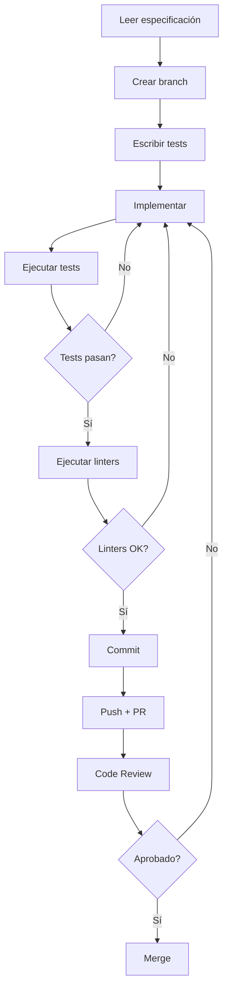

# Quick Start - Implementación de Mejoras

Guía rápida para comenzar con la implementación de las mejoras del Sistema_v5.

---

## 🚀 Inicio Rápido (5 minutos)

### Paso 1: Revisar Documentación
```bash
cd Sistema_v5/documentacion

# Leer en este orden:
# 1. Este archivo (QUICK_START_MEJORAS.md)
# 2. HOJA_DE_RUTA_MEJORAS.md - Plan completo
# 3. TRACKING_SPRINTS.md - Seguimiento de tareas
```

### Paso 2: Configurar Entorno
```bash
# Crear virtual environment
python -m venv venv
source venv/bin/activate  # En Windows: venv\Scripts\activate

# Instalar dependencias de desarrollo
pip install -r requirements-dev.txt

# Si no existe requirements-dev.txt, crear:
pip install pytest pytest-cov pytest-asyncio ruff mypy bandit radon
pip freeze > requirements-dev.txt
```

### Paso 3: Ejecutar Tests Existentes
```bash
# Ver estado actual
pytest tests/ -v --cov=pjn --cov-report=term-missing

# Ver cobertura actual
# Baseline: ~30%
```

### Paso 4: Ejecutar Análisis Estático
```bash
# Linting
ruff check Sistema_v5/pjn

# Type checking
mypy Sistema_v5/pjn

# Security
bandit -r Sistema_v5/pjn -ll

# Complejidad
radon cc Sistema_v5/pjn -a -nb
```

---

## 📋 Comenzar Sprint 1 - Día 1

### Tarea 1.1: Consolidar `_calcular_metricas_descargas()`

**Tiempo estimado:** 2 horas

#### 1. Entender el Problema
```bash
# Buscar duplicados
grep -n "_calcular_metricas_descargas" Sistema_v5/pjn/scraping/actuaciones.py

# Deberías ver:
# Línea 43: Primera definición
# Línea 201: Segunda definición (en parser también)
```

#### 2. Crear Branch
```bash
git checkout -b refactor/consolidar-calculo-metricas
```

#### 3. Identificar Diferencias
```bash
# Comparar ambas implementaciones
diff <(sed -n '43,65p' Sistema_v5/pjn/scraping/actuaciones.py) \
     <(sed -n '201,212p' Sistema_v5/pjn/parsers/actuaciones_parser.py)
```

#### 4. Escribir Test Primero
```python
# tests/test_actuaciones_refactor.py

import pytest
from pjn.models import Actuacion
from pjn.parsers.actuaciones_parser import _calcular_metricas_descargas

def test_metricas_lista_vacia():
    """Con lista vacía debe retornar ceros."""
    total, descargados, pendientes = _calcular_metricas_descargas([])
    assert (total, descargados, pendientes) == (0, 0, 0)

def test_metricas_sin_archivos():
    """Actuaciones sin archivos no deben contarse."""
    actuaciones = [
        Actuacion(
            indice=1,
            fecha="2025-01-01",
            tipo="RESOLUCION",
            detalle="Detalle",
            tiene_archivo=False,
            descargado=False
        )
    ]
    total, descargados, pendientes = _calcular_metricas_descargas(actuaciones)
    assert (total, descargados, pendientes) == (0, 0, 0)

def test_metricas_archivos_mixtos():
    """Debe contar correctamente mezcla de estados."""
    actuaciones = [
        Actuacion(indice=1, tiene_archivo=True, descargado=True),
        Actuacion(indice=2, tiene_archivo=True, descargado=False),
        Actuacion(indice=3, tiene_archivo=False, descargado=False),
        Actuacion(indice=4, tiene_archivo=True, descargado=True),
    ]
    total, descargados, pendientes = _calcular_metricas_descargas(actuaciones)
    assert (total, descargados, pendientes) == (3, 2, 1)

# Ejecutar tests
pytest tests/test_actuaciones_refactor.py -v
```

#### 5. Implementar Solución
```bash
# Editar Sistema_v5/pjn/scraping/actuaciones.py
# Eliminar definición de línea 43
# Importar desde parser

# Agregar al inicio del archivo:
from ..parsers.actuaciones_parser import _calcular_metricas_descargas
```

#### 6. Verificar
```bash
# Tests deben pasar
pytest tests/test_actuaciones_refactor.py -v

# Tests existentes también deben pasar
pytest tests/ -v

# Verificar que se eliminó duplicado
grep -c "_calcular_metricas_descargas" Sistema_v5/pjn/scraping/actuaciones.py
# Debe retornar 0 (solo import, no definición)
```

#### 7. Commit
```bash
git add -A
git commit -m "refactor: consolidar _calcular_metricas_descargas()

- Eliminar definición duplicada en actuaciones.py (línea 43)
- Usar implementación única desde actuaciones_parser.py
- Agregar tests para función consolidada

Refs: #ISSUE_NUMBER"
```

#### 8. PR
```bash
# Subir branch
git push origin refactor/consolidar-calculo-metricas

# Crear PR en GitHub/GitLab
# Usar template de PR (ver HOJA_DE_RUTA_MEJORAS.md)
```

---

## 🔄 Flujo de Trabajo Recomendado

### Para Cada Tarea



### Comandos Rápidos

```bash
# Antes de comenzar tarea
git checkout main
git pull
git checkout -b feature/nombre-descriptivo

# Durante desarrollo
pytest tests/ -v --cov=pjn  # Ejecutar tests
ruff check . --fix           # Fix auto de linting
mypy pjn                     # Type check

# Antes de commit
pytest tests/ -v             # Tests pasan
ruff check .                 # Sin errores
mypy pjn --strict            # Sin errores de tipos

# Commit
git add -A
git commit -m "tipo: descripción

Detalles adicionales

Refs: #ISSUE"

# Push y PR
git push origin feature/nombre-descriptivo
# Crear PR en GitHub
```

---

## 📊 Tracking Diario

### Daily Standup Template

```markdown
## Daily Standup - [FECHA]

### Ayer
- Tarea completada: [X]
- Bloqueado en: [Y]
- Horas trabajadas: [Z]

### Hoy
- Plan: [Tarea siguiente]
- Estimación: [Horas]

### Blockers
- [Listar blockers]

### Métricas
- Tests agregados: X
- Cobertura actual: Y%
- PRs creados: Z
```

### End of Day Checklist

- [ ] Código commiteado
- [ ] Tests ejecutados y pasando
- [ ] PR creado (si tarea completa)
- [ ] TRACKING_SPRINTS.md actualizado
- [ ] Blockers documentados

---

## 🛠️ Herramientas Útiles

### VS Code Extensions
```json
{
  "recommendations": [
    "ms-python.python",
    "ms-python.vscode-pylance",
    "charliermarsh.ruff",
    "ms-python.mypy-type-checker",
    "streetsidesoftware.code-spell-checker"
  ]
}
```

### Pre-commit Hook
```bash
# Crear .git/hooks/pre-commit

#!/bin/bash
set -e

echo "🔍 Running pre-commit checks..."

# Tests
echo "Running tests..."
pytest tests/ -q || exit 1

# Linting
echo "Running linter..."
ruff check Sistema_v5/pjn || exit 1

# Type checking
echo "Running type checker..."
mypy Sistema_v5/pjn || exit 1

echo "✅ All checks passed!"
```

```bash
# Hacer ejecutable
chmod +x .git/hooks/pre-commit
```

---

## 📖 Referencias Rápidas

### Estructura del Proyecto
```
Sistema_v5/
├── pjn/
│   ├── scraping/      # Lógica de scraping
│   ├── parsers/       # Parsing de datos
│   ├── models/        # Modelos de datos
│   ├── monitor/       # Sistema de monitoreo
│   ├── utils/         # Utilidades
│   └── config.py      # Configuración
├── tests/             # Tests
├── documentacion/     # Docs del proyecto
└── web_app/          # Interfaz web
```

### Archivos Importantes
- `HOJA_DE_RUTA_MEJORAS.md` - Plan completo
- `TRACKING_SPRINTS.md` - Seguimiento
- `QUICK_START_MEJORAS.md` - Esta guía
- `config.py` - Configuración centralizada
- `exceptions.py` - Excepciones custom

### Comandos Más Usados
```bash
# Tests
pytest tests/ -v                    # Todos los tests verbose
pytest tests/test_x.py -k "nombre"  # Test específico
pytest --cov=pjn --cov-report=html  # Coverage HTML

# Linting
ruff check .                        # Check
ruff check . --fix                  # Fix auto

# Type checking
mypy pjn                            # Check básico
mypy pjn --strict                   # Strict mode

# Buscar en código
grep -r "patron" Sistema_v5/pjn     # Buscar texto
rg "patron" Sistema_v5/pjn          # Buscar (ripgrep)

# Git
git log --oneline --graph           # Historia bonita
git blame archivo.py                # Ver quien modificó
```

---

## ❓ FAQ

### ¿Puedo trabajar en múltiples tareas en paralelo?
**No recomendado.** Es mejor completar una tarea antes de comenzar otra para evitar conflictos de merge.

### ¿Qué hago si encuentro un bug no relacionado?
Crear un issue separado. No mezclar fixes en PRs de refactorización.

### ¿Cuándo pedir code review?
Inmediatamente después de crear el PR. No esperar a tener múltiples PRs.

### ¿Qué hacer si los tests existentes fallan?
1. Verificar que no rompiste algo
2. Si el test estaba mal, arreglarlo en el mismo PR
3. Documentar en el PR por qué el test necesitaba cambiar

### ¿Cómo priorizar si hay múltiples issues?
Seguir el orden de la hoja de ruta. Las tareas están ordenadas por dependencias.

---

## 🆘 Troubleshooting

### Tests no pasan
```bash
# Ver más detalles
pytest tests/ -vv -s

# Ejecutar solo el que falla
pytest tests/test_x.py::test_especifico -vv

# Ver coverage
pytest --cov=pjn --cov-report=term-missing
```

### Mypy reporta errores
```bash
# Ver todos los errores
mypy pjn --show-error-codes

# Ignorar temporalmente
# Agregar  # type: ignore[error-code]
```

### Ruff reporta errores
```bash
# Ver qué reglas están violadas
ruff check . --show-source

# Deshabilitar regla específica (último recurso)
# Agregar  # noqa: RULE_CODE
```

### Git conflicts
```bash
# Actualizar desde main
git checkout main
git pull
git checkout tu-branch
git rebase main

# Resolver conflictos
# Editar archivos marcados como conflict
git add archivo-resuelto
git rebase --continue
```

---

## 📞 Contacto

**Problemas técnicos:** [Canal técnico]
**Preguntas sobre tareas:** [Canal del proyecto]
**Code reviews:** [Mencionar en PR]

---

**Última actualización:** 2025-10-16
**Versión:** 1.0
