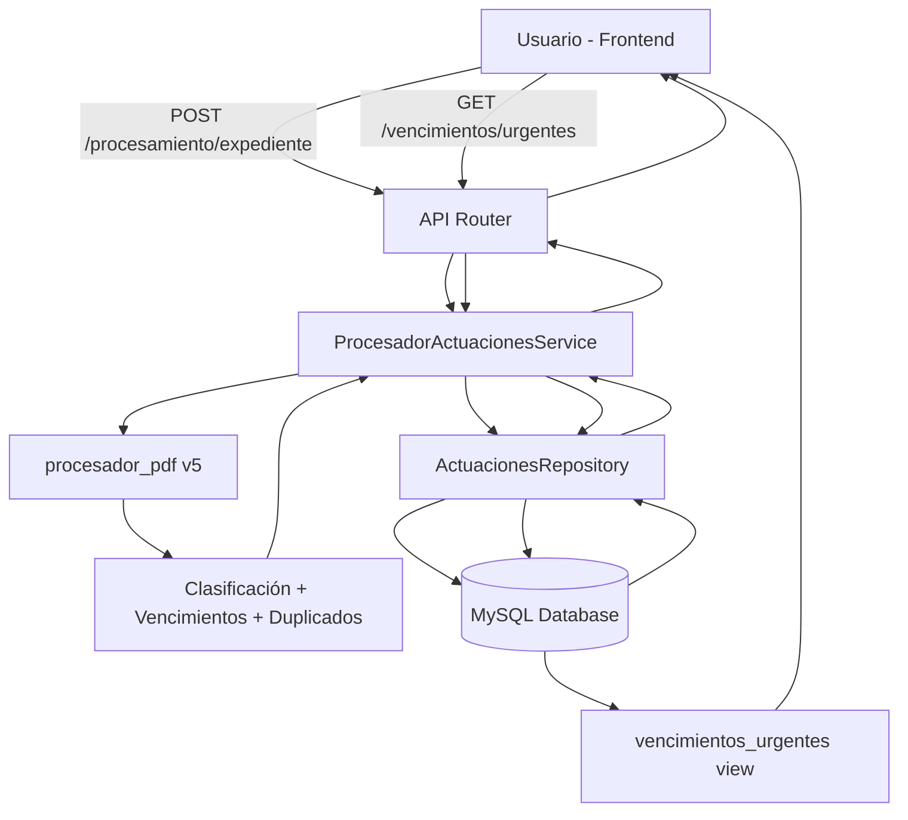

# Implementación del Procesador PDF en Sistema v6

## Resumen

Se ha implementado exitosamente la integración del módulo `procesador_pdf` de Sistema v5 en Sistema v6, incluyendo backend completo (servicios + API REST) y frontend (componentes React + TypeScript).

**Fecha de implementación**: 18 de noviembre de 2025
**Versión procesador_pdf**: 1.0.0
**Estado**: ✅ Implementación completada - Pendiente de testing

---

## Componentes Implementados

### 1. Backend (Python/FastAPI)

#### 1.1 Dependencias Agregadas
**Archivo**: `requirements.txt`

```python
# Procesamiento de PDFs (para módulo procesador_pdf)
PyPDF2>=3.0.0
pdfplumber>=0.11.0
pytesseract>=0.3.10  # Opcional - Requiere Tesseract instalado en sistema
pdf2image>=1.16.0     # Opcional - Para OCR
```

#### 1.2 Migración de Base de Datos
**Archivos**:
- `database/migrations/001_add_procesador_pdf_fields.sql`
- `database/migrations/001_add_procesador_pdf_fields_rollback.sql`

**Cambios en BD**:
- ✅ Nuevos campos en tabla `actuaciones`:
  - `utilidad` ENUM('nula', 'baja', 'media', 'alta')
  - `score` INT (0-100)
  - `motivo_clasificacion` TEXT
  - `requiere_pdf` BOOLEAN
  - `tiene_plazo_probable` BOOLEAN
  - `es_duplicado_probable` BOOLEAN
  - `keywords_detectados` JSON
  - `fecha_clasificacion` DATETIME
  - `texto_extraido` LONGTEXT
  - `hash_contenido` VARCHAR(64)

- ✅ Nueva tabla `vencimientos`:
  - Almacena vencimientos procesales detectados
  - Incluye tipo, fechas, plazos, estado, confianza
  - Foreign key a `actuaciones(id)`

- ✅ Nueva tabla `duplicados_detectados`:
  - Registra duplicados detectados automáticamente
  - Tipo (exacto, semántico, parcial)
  - Similitud y hash normalizado

- ✅ Nueva tabla `procesamiento_estadisticas`:
  - Estadísticas por expediente procesado
  - Métricas de rendimiento y reducción de volumen

- ✅ Vistas optimizadas:
  - `vencimientos_urgentes`: Vencimientos próximos con nivel de urgencia
  - `actuaciones_alta_utilidad`: Actuaciones de alta/media utilidad

**Para aplicar la migración**:
```bash
mysql -u root -p sintaxis < database/migrations/001_add_procesador_pdf_fields.sql
```

**Para revertir**:
```bash
mysql -u root -p sintaxis < database/migrations/001_add_procesador_pdf_fields_rollback.sql
```

#### 1.3 Servicio de Procesamiento
**Archivo**: `Sistema_v6/application/services/procesador_actuaciones_service.py`

**Clase Principal**: `ProcesadorActuacionesService`

**Funcionalidades**:
- ✅ Wrapper sobre `Sistema_v5.procesador_pdf`
- ✅ Procesamiento de actuaciones individuales
- ✅ Procesamiento de expedientes completos
- ✅ Persistencia automática en MySQL
- ✅ Consulta de vencimientos urgentes
- ✅ Obtención de estadísticas

**Clase Auxiliar**: `ActuacionesRepository`
- Gestiona todas las operaciones de BD
- Métodos para guardar clasificaciones, vencimientos, duplicados, estadísticas

**Uso**:
```python
from application.services.procesador_actuaciones_service import ProcesadorActuacionesService

# Configurar
db_config = {
    "host": "localhost",
    "port": 3306,
    "database": "sintaxis",
    "user": "root",
    "password": ""
}

servicio = ProcesadorActuacionesService(db_config)

# Procesar expediente
resultado = await servicio.procesar_expediente_completo(
    numero_expediente="CAF 12345/2024",
    actuaciones=[...],
    rutas_pdf={1: "/path/to/pdf.pdf"}
)
```

#### 1.4 API REST
**Archivo**: `Sistema_v6/presentation/api/rest/routers/procesamiento.py`

**Endpoints Implementados**:

| Método | Ruta | Descripción |
|--------|------|-------------|
| POST | `/api/v1/procesamiento/actuacion` | Procesar actuación individual |
| POST | `/api/v1/procesamiento/expediente` | Procesar expediente completo |
| GET | `/api/v1/procesamiento/vencimientos/urgentes` | Obtener vencimientos urgentes (próximos 7 días) |
| GET | `/api/v1/procesamiento/expediente/{numero}/estadisticas` | Estadísticas de un expediente |
| GET | `/api/v1/procesamiento/actuaciones/utilidad/{nivel}` | Filtrar actuaciones por utilidad |
| GET | `/api/v1/procesamiento/estadisticas/globales` | Estadísticas globales del sistema |

**Modelos Pydantic**: Validación completa de request/response

#### 1.5 Configuración
**Archivo**: `Sistema_v6/.env`

```env
# MySQL (para procesador_pdf)
MYSQL_HOST=localhost
MYSQL_PORT=3306
MYSQL_DATABASE=sintaxis
MYSQL_USER=root
MYSQL_PASSWORD=
```

---

### 2. Frontend (React + TypeScript)

#### 2.1 Tipos TypeScript
**Archivo**: `frontend/src/types/procesamiento.ts`

**Tipos Principales**:
- `UtilidadJuridica` enum
- `TipoVencimiento` enum
- `NivelUrgencia` enum
- `ActuacionInput`, `ClasificacionActuacion`, `Vencimiento`
- `VencimientoUrgente`, `ActuacionPorUtilidad`
- `EstadisticasExpediente`, `EstadisticasGlobales`
- `ResultadoProcesamiento`, `ResultadoExpediente`

**Utilidades**:
- `getColorUtilidad()`, `getColorUrgencia()`
- `formatReduccion()`, `formatDiasRestantes()`
- `getNivelUrgencia()`
- Constantes de colores y labels

#### 2.2 API Cliente
**Archivo**: `frontend/src/api/procesamientoApi.ts`

**Funciones Principales**:
- `procesarActuacion()` - Procesar actuación individual
- `procesarExpediente()` - Procesar expediente completo
- `obtenerVencimientosUrgentes()` - Listar vencimientos urgentes
- `obtenerEstadisticasExpediente()` - Stats de un expediente
- `obtenerActuacionesPorUtilidad()` - Filtrar por utilidad
- `obtenerEstadisticasGlobales()` - Stats del sistema

**Funciones Helper**:
- `procesarExpedientesBatch()` - Procesar múltiples expedientes
- `obtenerDashboardData()` - Datos completos para dashboard
- `obtenerActuacionesPorTodasUtilidades()` - Todas las utilidades
- `calcularTiempoEstimado()`, `formatearTiempoProcesamiento()`
- `requiereAtencionInmediata()`, `agruparVencimientosPorUrgencia()`
- `calcularMetricasRendimiento()`, `generarResumenProcesamiento()`

#### 2.3 Componentes React
**Directorio**: `frontend/src/components/procesamiento/`

##### ProcesamientoDashboard.tsx
Dashboard principal con:
- 📊 4 tarjetas de métricas globales (expedientes, vencimientos, reducción, actuaciones)
- 🔥 Lista de vencimientos urgentes
- ⭐ Grid de actuaciones de alta utilidad
- 🔄 Botón de actualización
- ⚠️ Manejo de estados de carga y error

##### VencimientosUrgentesLista.tsx
Lista de vencimientos con:
- 🎨 Código de colores por urgencia (vencido, crítico, urgente, próximo, normal)
- 📅 Fecha de vencimiento formateada
- 📄 Información del expediente y actuación
- ⏰ Días restantes
- 🔍 Tipo de vencimiento (cédula, traslado, alegato, etc.)

##### ActuacionCard.tsx
Tarjeta individual de actuación con:
- 🏷️ Badge de utilidad (alta, media, baja, nula)
- 📊 Score de clasificación
- 📋 Número de expediente
- 📝 Tipo y detalle de actuación
- ⏰ Vencimiento (si tiene)
- 🚨 Indicador de urgencia

##### index.ts
Export centralizado de todos los componentes

---

## Flujo de Datos



---

## Instalación y Configuración

### Requisitos Previos
1. ✅ Python 3.13+
2. ✅ MySQL 8.0+
3. ✅ Node.js 18+ (para frontend)
4. ⚠️ Tesseract (opcional - solo para OCR)

### Paso 1: Instalar Dependencias Python
```bash
cd /Users/davidalejandroliva/PycharmProjects/sintaXis
pip install -r requirements.txt
```

### Paso 2: Configurar Base de Datos
```bash
# 1. Crear base de datos (si no existe)
mysql -u root -p
CREATE DATABASE IF NOT EXISTS sintaxis CHARACTER SET utf8mb4 COLLATE utf8mb4_unicode_ci;
exit;

# 2. Aplicar migración
mysql -u root -p sintaxis < database/migrations/001_add_procesador_pdf_fields.sql

# 3. Configurar credenciales en .env
nano Sistema_v6/.env
# Editar variables MYSQL_*
```

### Paso 3: Verificar Importación de procesador_pdf
```bash
cd Sistema_v6
python -c "from Sistema_v5.procesador_pdf import procesar_expediente; print('OK')"
```

Si hay error, verificar que `Sistema_v5/procesador_pdf/` existe y tiene todos los archivos.

### Paso 4: Instalar Dependencias Frontend
```bash
cd Sistema_v6/frontend
npm install
```

### Paso 5: Verificar Tipos TypeScript
```bash
cd Sistema_v6/frontend
npx tsc --noEmit  # Verificar que no hay errores de tipos
```

---

## Testing e Integración

### Test Backend

#### Test 1: Importación del módulo
```python
# test_import_procesador.py
import sys
from pathlib import Path

sistema_v5_path = Path(__file__).parent.parent / "Sistema_v5"
sys.path.insert(0, str(sistema_v5_path))

from Sistema_v5.procesador_pdf import (
    procesar_actuacion,
    ClasificadorActuaciones,
    UtilidadJuridica
)

print("✅ Importación exitosa")
```

#### Test 2: Servicio de procesamiento
```python
# test_servicio_procesamiento.py
import asyncio
from application.services.procesador_actuaciones_service import ProcesadorActuacionesService

async def test():
    db_config = {
        "host": "localhost",
        "port": 3306,
        "database": "sintaxis",
        "user": "root",
        "password": ""
    }

    servicio = ProcesadorActuacionesService(db_config)

    actuacion = {
        "id": 1,
        "tipo": "SENTENCIA",
        "detalle": "Sentencia definitiva que hace lugar a la demanda",
        "tiene_archivo": False
    }

    resultado = await servicio.procesar_actuacion_individual(
        actuacion=actuacion,
        guardar_en_bd=False  # No guardar en test
    )

    print(f"✅ Clasificación: {resultado.clasificacion.utilidad.value}")
    print(f"✅ Score: {resultado.clasificacion.score}")
    print(f"✅ Motivo: {resultado.clasificacion.motivo}")

asyncio.run(test())
```

#### Test 3: API Endpoints (con curl)
```bash
# 1. Iniciar servidor FastAPI
cd Sistema_v6
uvicorn presentation.api.rest.main:app --reload

# 2. Test endpoint (en otra terminal)
curl -X GET http://localhost:8000/api/v1/procesamiento/estadisticas/globales

# 3. Test procesar actuación
curl -X POST http://localhost:8000/api/v1/procesamiento/actuacion \
  -H "Content-Type: application/json" \
  -d '{
    "actuacion": {
      "id": 1,
      "tipo": "CEDULA_ELECTRONICA",
      "detalle": "Notificación cédula electrónica del 15/03/2024",
      "tiene_archivo": false
    },
    "guardar_en_bd": false
  }'
```

### Test Frontend

#### Test 1: Compilación TypeScript
```bash
cd Sistema_v6/frontend
npx tsc --noEmit
```

#### Test 2: Imports de componentes
```typescript
// test_imports.ts
import {
  ProcesamientoDashboard,
  VencimientosUrgentesLista,
  ActuacionCard
} from '@/components/procesamiento'

import { obtenerDashboardData } from '@/api/procesamientoApi'

console.log('✅ Imports exitosos')
```

#### Test 3: Integración en App
```tsx
// App.tsx o página principal
import { ProcesamientoDashboard } from '@/components/procesamiento'

function App() {
  return (
    <div>
      <ProcesamientoDashboard />
    </div>
  )
}
```

---

## Próximos Pasos

### Tareas Pendientes

#### Alta Prioridad
- [ ] **Registrar router de procesamiento en FastAPI app**
  - Agregar `from presentation.api.rest.routers import procesamiento`
  - Incluir router: `app.include_router(procesamiento.router)`

- [ ] **Probar integración completa end-to-end**
  - Backend: Procesar expediente real desde API
  - Frontend: Visualizar resultados en dashboard
  - Verificar persistencia en BD

- [ ] **Agregar manejo de errores robusto**
  - Try/catch en componentes React
  - Mensajes de error informativos
  - Retry logic para requests fallidos

#### Media Prioridad
- [ ] **Tests unitarios**
  - Tests para `procesador_actuaciones_service.py`
  - Tests para endpoints REST
  - Tests para componentes React

- [ ] **Optimizaciones de performance**
  - Paginación en listas largas
  - Lazy loading de componentes
  - Caché de estadísticas globales

- [ ] **Mejoras de UX**
  - Loading skeletons
  - Animaciones de transición
  - Tooltips informativos
  - Filtros y búsqueda

#### Baja Prioridad
- [ ] **Documentación adicional**
  - JSDoc para funciones TypeScript
  - Docstrings para clases Python
  - Guía de usuario

- [ ] **Features avanzados**
  - Exportar estadísticas a Excel
  - Gráficos interactivos (Chart.js)
  - Notificaciones de vencimientos
  - Dashboard personalizable

---

## Arquitectura del Sistema

### Clean Architecture

```
Sistema_v6/
├── core/
│   └── domain/              # Entidades y reglas de negocio
├── application/
│   └── services/            # ✅ procesador_actuaciones_service.py
├── infrastructure/
│   └── persistence/         # ✅ ActuacionesRepository
├── presentation/
│   └── api/rest/routers/    # ✅ procesamiento.py
└── frontend/
    ├── src/
    │   ├── types/           # ✅ procesamiento.ts
    │   ├── api/             # ✅ procesamientoApi.ts
    │   └── components/      # ✅ procesamiento/
```

### Tecnologías Utilizadas

**Backend**:
- FastAPI 0.115.12
- mysql-connector-python 9.2.0
- PyPDF2 3.0.0
- pdfplumber 0.11.0
- Sistema_v5.procesador_pdf 1.0.0

**Frontend**:
- React 18.3.0
- TypeScript 5.3.0
- Vite 5.0.0
- Tailwind CSS 3.4.0
- Radix UI (Dialog, etc.)
- lucide-react 0.303.0
- date-fns 4.1.0

---

## Métricas de Implementación

- **Archivos creados**: 11
- **Líneas de código Python**: ~800
- **Líneas de código TypeScript**: ~1,200
- **Endpoints REST**: 6
- **Componentes React**: 3
- **Tablas de BD**: 3 nuevas + 1 modificada
- **Vistas de BD**: 2

---

## Soporte y Troubleshooting

### Problema: Error al importar procesador_pdf
**Solución**: Verificar que `Sistema_v5/procesador_pdf/` existe y está en el PYTHONPATH:
```python
import sys
from pathlib import Path
sistema_v5_path = Path(__file__).parent.parent.parent / "Sistema_v5"
sys.path.insert(0, str(sistema_v5_path))
```

### Problema: Error de conexión a MySQL
**Solución**: Verificar credenciales en `.env` y que MySQL está corriendo:
```bash
mysql -u root -p -e "SELECT 1"
```

### Problema: Tipos TypeScript no encontrados
**Solución**: Verificar que el path alias `@` está configurado en `tsconfig.json`:
```json
{
  "compilerOptions": {
    "paths": {
      "@/*": ["./src/*"]
    }
  }
}
```

### Problema: date-fns no instalado
**Solución**:
```bash
cd frontend
npm install date-fns
```

---

## Changelog

### v1.0.0 - 2025-11-18
- ✅ Implementación inicial completa
- ✅ Backend: Servicio + API REST
- ✅ Frontend: Tipos + API Cliente + Componentes
- ✅ Base de datos: Migración completa
- ⏳ Pendiente: Testing e integración

---

## Contacto y Referencias

- **Documentación procesador_pdf v5**: `Sistema_v6/Plan_performance/MODULO_PROCESADOR_PDF_IMPLEMENTADO.md`
- **Análisis v5**: `Sistema_v6/Plan_performance/ANALISIS_PROCESAMIENTO_PDFs_V5.md`
- **Plan de optimización**: `Sistema_v6/Plan_performance/PLAN_OPTIMIZACION_SISTEMA.md`

---

**Última actualización**: 18 de noviembre de 2025
**Estado**: ✅ Implementación completada - Pendiente de testing integrado
